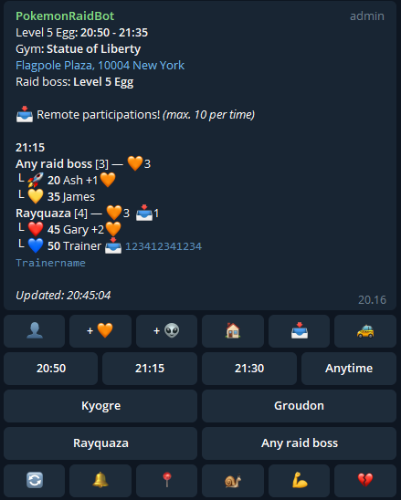
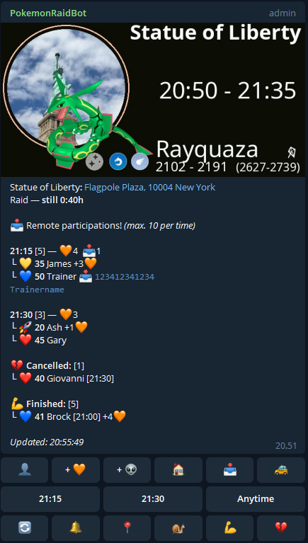

PokemonRaidBot
==============

Telegram webhook bot for organizing raids in Pokemon Go. Developers are welcome to join https://t.me/PokeParkSupport and the repository can be found at https://github.com/pokepark/PokemonRaidBot

*Default text poll:*

*With raid picture:*

Installation
============

There is no central bot so every community runs their own! While this is a bit more difficult it provides much better customization and control!

  #. First follow either the :doc:`docker` instructions or the :doc:`manual_install` instructions. For some bits the Docker documentation isn't 100% and you'll want to refer to the manal install for example for DB setup.
  #. Next, proceed to :doc:`config`
  #. Finally, connect the bot to Telegram with the instructions below.

Telegram Setup
--------------

Since the bot is installed and run separately for every community, you also need your own API token.
To obtain a new bot token from Telegram, start a chat with https://t.me/BotFather and create a bot token.

Set the following bot settings:
  * Enable Inline mode
  * Allow Groups
  * Group Privacy off

Installing the Webhook
----------------------

To tie the bot installation to the Telegram bot API it needs to be submitted as a webhook. This is done by visiting the
provided webhook.html form in a web browser.

Navigate to https://yourdomain.com/botdir/webhook.html and fill in the form.
After submit success test your bot by sending it a /help command. If this does not work, see your web server error_log for details.

Available Languages
^^^^^^^^^^^^^^^^^^^

You can set several languages for the bot. Available languages are listed below. For more information see :doc:`config`.
You can submit translations to expand our list of lanuages! For more information, see :doc:`development`.

* DE (German)
* EN (English)
* FI (Finnish)
* FR (French)
* IT (Italian)
* NL (Dutch)
* NO (Norwegian)
* PT-BR (Brazilian Portugese)
* RU (Russian)
* PL (Polish)

.. toctree::
  :maxdepth: 2
  :caption: Contents:

  usage
  docker
  manual_install
  config
  metrics
  debug
  maintenance
  development

